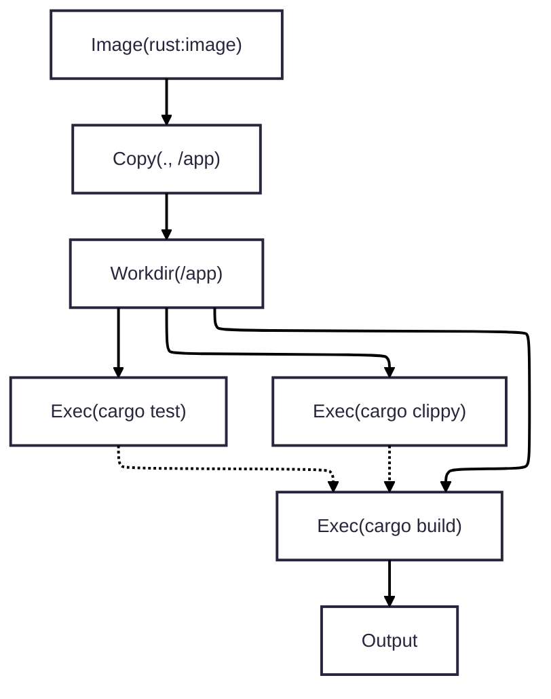

> [!IMPORTANT]
> Serpentine is a work in progress and not suitable for production yet.

# Serpentine 


Serpentine is a workflow runner with a huge focus on simplicity and developer ergonomics.
It uses its own custom DSL called snek which lets you define a graph of steps to execute.

Serpentine does **not** have the concept of jobs, pipelines, etc. it has the concept of the node, and which nodes depend on which, the end.
This makes it trivally easy to share setup logic, parallize workflows, etc.

```snek
Image("rust:latest") > Copy(".", "/app") > Workdir("/app") = base;

base > Exec("cargo test") = test;
base > Exec("cargo clippy") = clippy;

base > !(test, clippy) Exec("Cargo build") > Output();
```

This represents the following graph:


The serpentine runtime will intelligently spawn a max of 3 containers for this job, and run the test and clippy in parallel.
