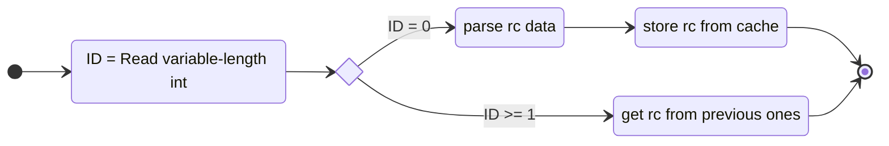
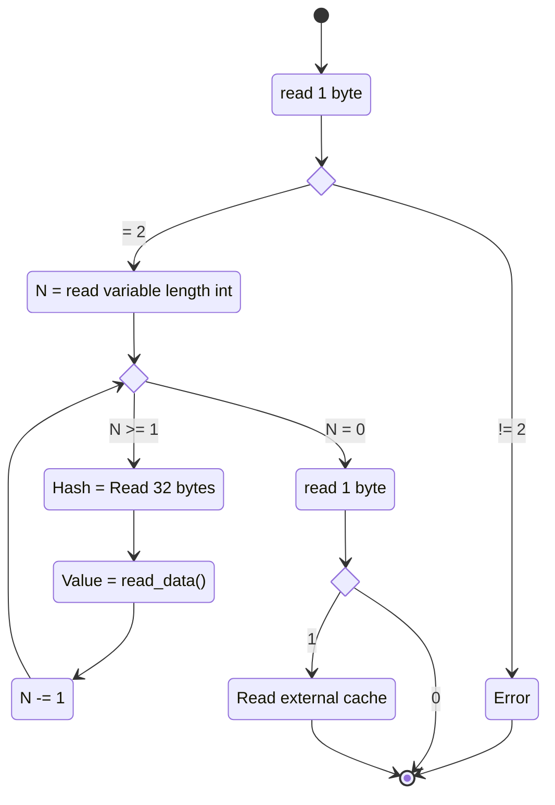

# Caching

> [!NOTE]
> This is the internal caching doc and describes the current format of the cache files for contributors, for user facing docs on caching see [Caching](caching.md)

## Concepts

### Hashing

A hash is for the purpose of caches a deterministic way to distill a value into a much smaller consistently sized series of bytes, in the case of serpentine we use [blake3](https://crates.io/crates/blake3),
which produces hashes of 32 bytes, or 256 bits. This is a cryptographic hash which means hash collisions between different inputs are extremely unlikely. 

There is a performance trade-off here, on the one hand hashing takes time and some of our data is smaller than 32 bytes, take say the string `rust`, however some of our data is stuff like multi megabyte files, which ofc is much better to store just a 32 byte hash of.
While we could implement a more complex system where we hash big values and for small ones do lookup on them directly, at the end of the day this will intruduce a lot of extra overhead to the serializer and deserializer, and just be more complex than needed.

### Old vs New cache

Serpentine maintains two cache maps in memory when running, the "old" cache is initally populated with values loaded from disk,
whenever there is a cache hit the value is moved to the "new" cache.
When it comes time to export the cache back to disk, by default serpentine will export both, but if the `--clean-old` flag is specififed only caches in the "new" cache are written to disk
(and the cleanup routine runs for the ones in the "old" cache)

### Cache-ability

Not all builtin nodes are cached, the general rule of thumb is that cheap operations, such as `Env` and `Join` arent cached.
While expensive nodes are, such as `Exec`.
There is however some import stuff to take into consideration, for example `With` is cached despite usually just being small file copies,
this is for the crucial reason as to allow cache hits on downstream nodes as `With` will generate a new containerd snapshot if it runs.

In general most container nodes generate new snapshots, which means that nodes arent pure in terms of exact values or even their hashes, *but* they are semantically pure (meaning even if the snapshot name is different, the snapshot is semantically equivalent to eachother), which is what lets us still cache these nodes.
But this is also why its very important to consider which nodes might cause cache misses down stream and attempt to minimize it, either by caching them as well, or making them more deterministic.

### Cache validity

Serpentine cache is versioned seperately from serpentine itself, in its `CACHE_COMPATABILITY_VERSION` constant in `cache.rs`.
In short this encodes breaking changes to the cache (which do not need to be breaking changes to serpentine itself), the rustdoc in `cache.rs` goes into more detail here.

## File format

### Header

The file starts with 1 byte which is the `CACHE_COMPATABILITY_VERSION`, if this does not match the running process the cache should instnatly fail to load.
The rest of the cache loading assumes the data is correct.

> [!NOTE]
> Serpentine commits itself to no `unsafe`, as such we do perform utf-8 validation and return errors if it fails,
> *but* in general data is assumed to be correct, and serpentine might create a non-sense cache if it isnt (if it somehow doesnt cause a utf-8 validation fail).

### variable-length encoded values
Serpentine uses a lot of `u64` values, storing these as their full 8 bytes is terribly wasteful when most values are <= 255.
For this serpentine uses a simple format of storing the value in little-endian, where the most significant bit signifies wether theres more bytes following it. 

| Serialized | Source |
| --- | --- |
| `00000011` | `00000011` |
| `10000011 00000001` | `10000011` |
| `10000011 00001001` | `00000100 10000011` |
| `10000011 10001001 00000001` | `10000100 10000011` |


### Cache data

The next bytes are a variable-length encoded `u64` in little-endian encoding the number of cache entries.
Each cache entry is stored as 32 bytes encoding the hash, then `Data` types encoding.

| Bytes | Description |
| --- | --- |
| 32 | `blake3` hash |
| 1.. | `Data` |

In general `Data` is serialized straight-forward, encoding each field inline, arbitrary length data being length prefixed. 
And we will not document its format as it should be considerd to live outside the cache systems concern.

### `Rc`

`Data` makes heavy use of `Rc`, and its expected that multiple cache values will contain the same `Rc`.
As such when serialized rcs are de-duplicated by pointer.

Rcs start with a variable-length encoded id, if the id is `0` then the following bytes will be read as the rc content, if not the rc will be looked up sequentually (**1-indexed**) from the list of rcs seen so far.



Very importantly the ids are assigned in order of when a item would be fully processed, not the order in which they start in the binary. This is very important for nested data, as nested `Rc`s will get ids before their containing value.

For example given:
```rust
struct InnerValue { /* ... */ }
struct Wrapper {
    a: Rc<InnerValue>,
    b: Rc<InnerValue>,
}
```
A `Rc<Wrapper>` would be serialized as.

| Value | bytes | RC Id |
| :---: | :---: | :--- |
| `Rc<Wrapper>` | `00000000` | 3 |
| `Rc<InnerValue>` | `00000000` | 1 |
| `InnerValue` | `...` | |
| `Rc<InnerValue>` | `00000000` | 2 |
| `InnerValue` | `...` | |

or if the two inner `Rc`s are the same allocation:
| Value | bytes | RC Id |
| :---: | :---: | :--- |
| `Rc<Wrapper>` | `00000000` | 2 |
| `Rc<InnerValue>` | `00000000` | 1 |
| `InnerValue` | `...` | |
| `Rc<InnerValue>` | `00000001` | 1 |

### Standalone cache

The standalone cache export is a arbitrary binary blob at the end of the file, after the main data section if the next byte is `1` the system will stream the rest of the file to the external cache implementation. if its `0` it considerds itself done with reading the file.

> [!NOTE]
> The exact format of the binary format in this section while not part of the cache implementation, is implemented by [Containerd](containerd.md#export)

### Final diagram

| Bytes | Description |
| :---: | ----------- |
| 1     | Cache version |
| 1..=10     | number of cache entries (`N`) |
| 0..   | `N` Cache entries (see above) |
| 1     | `1`/`0` - standalone cache mode (`S`)|
| if `S=1`: 0.. | Standalone cache export, see [containerd](containerd.md#export) |


