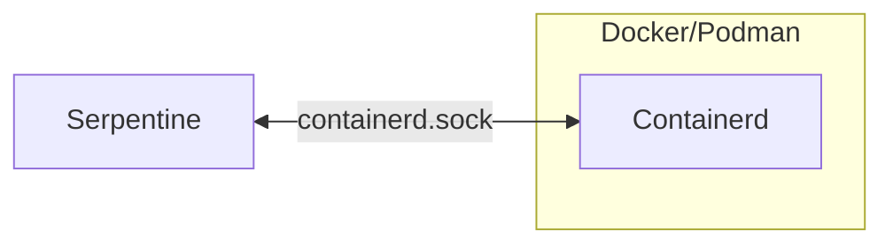
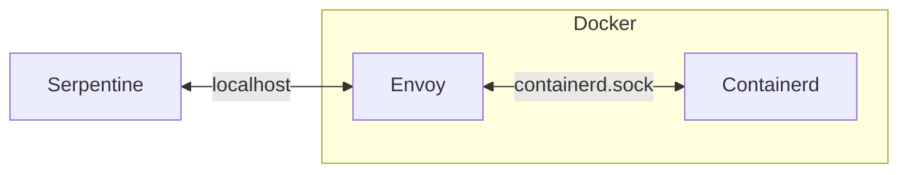
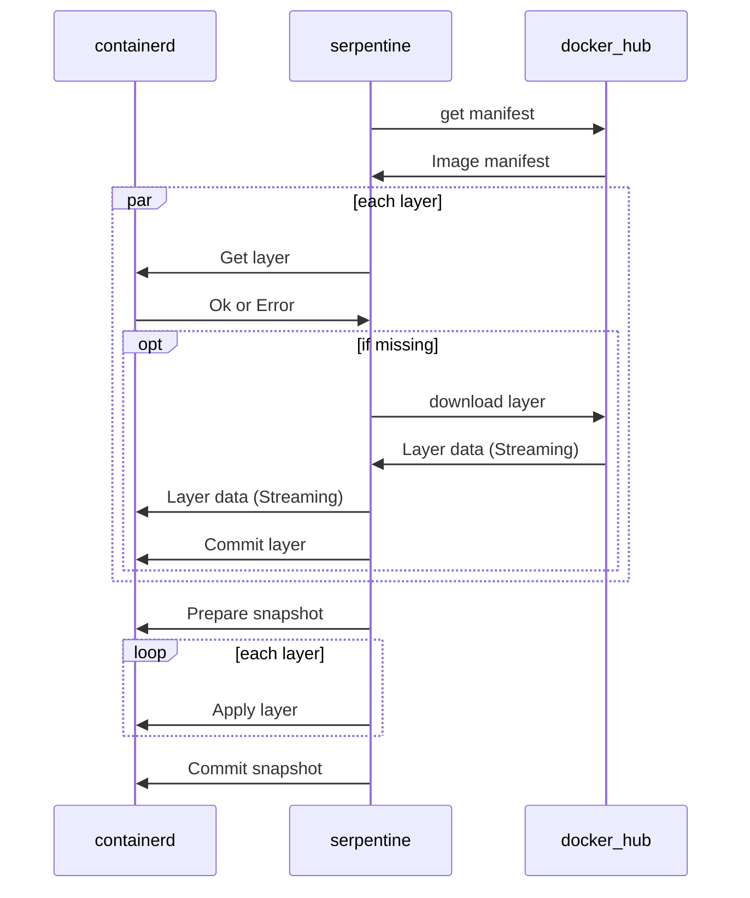

# Containerd

Serpentine uses [containerd](https://github.com/containerd/containerd) in much the same way [Buikit](https://github.com/moby/buildkit) does, this page documents the the high level flow of the code in `src/engine/containerd.rs`.

## Running containerd
Serpentine uses its own containerd image that downloads the `containerd` and `runc` binaries from github.

### Linux
On linux serpentine speaks to containerd directly over a unix socket.

### Windows/Mac
On windows and mac, due to not being able to mount unix sockets out of the container (and containerd not supporting tcp natively) we deploy a extra sidecar container using [Envoy](https://www.envoyproxy.io/) to provide secure access to the socket using auth tokens, this is very important to prevent [Localhost Drive-by](https://en.wikipedia.org/wiki/Drive-by_download)

## Pulling images
Pulling a image works similar to docker, serpentine will conntact a OCI compataible hub and pull the image manifest, then it will in parallel query containerd for if it contains the needed layers and if not stream them directly from the hub to the containerd (i.e serpentine never holds the entire image in memory itself). The `pull_image` function returns a `ContainerState` which is a snapshot key, specificaly the snapshot key in the exact version info of the image in this case.

