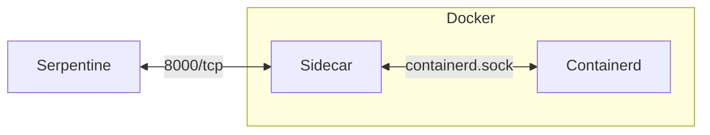
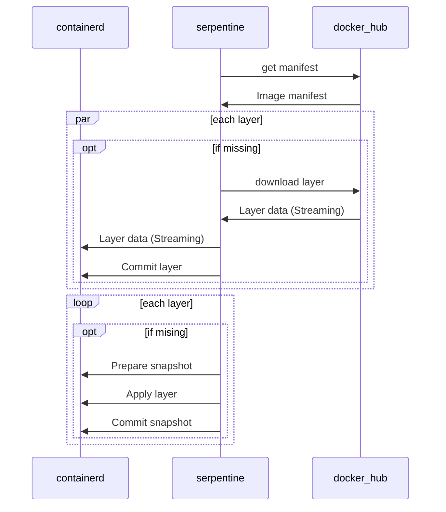
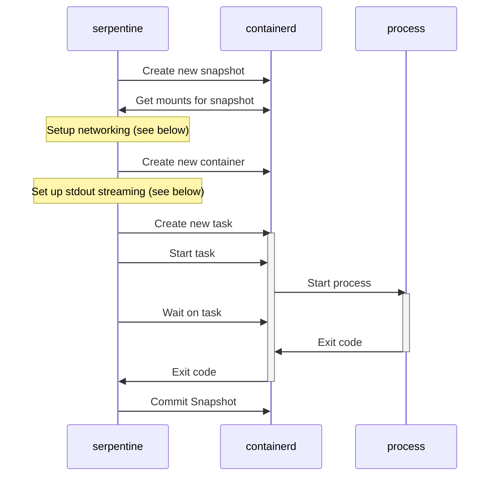
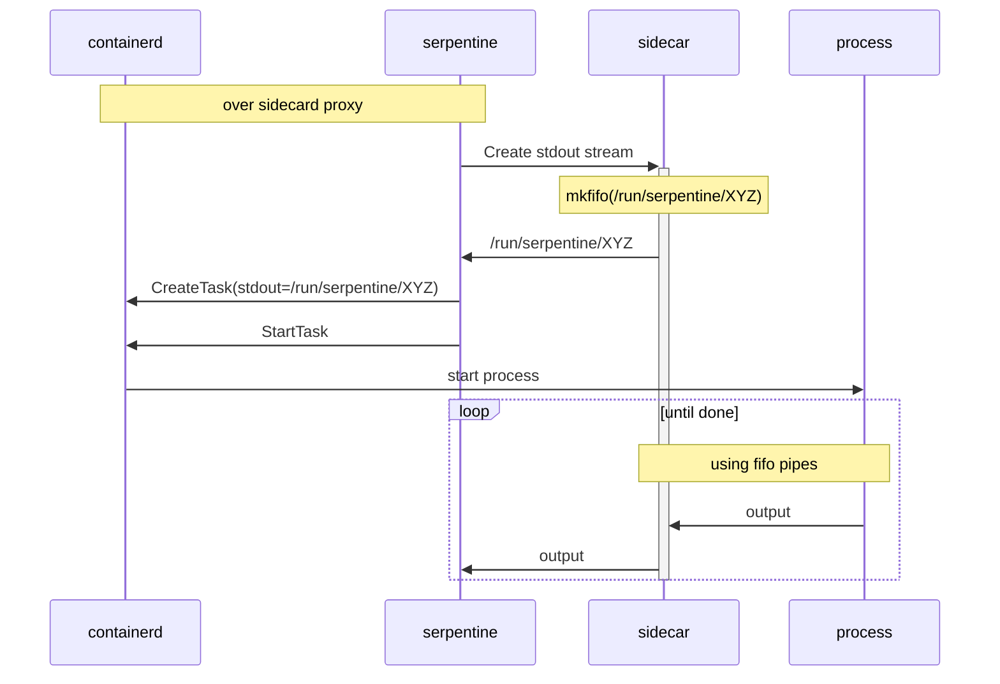
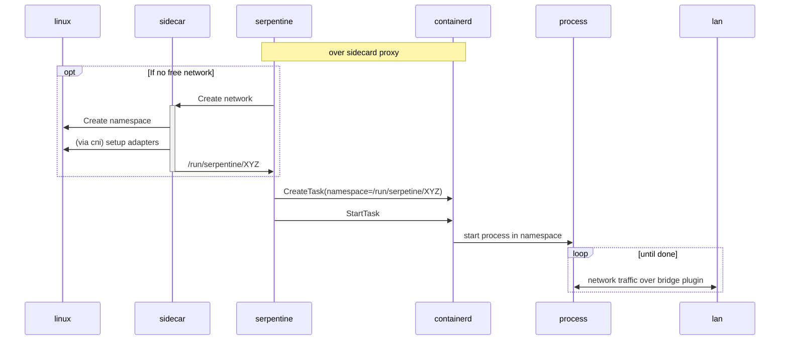

# Containerd

Serpentine uses [containerd](https://github.com/containerd/containerd) in much the same way [Buikit](https://github.com/moby/buildkit) does, this page documents the the high level flow of the code in `src/engine/containerd.rs`.

## Running containerd
Serpentine uses its own containerd image that downloads the `containerd` and `runc` binaries from github, and a few other supporting tools.
It also loads up a small `sidecar` proxy that primarly proxies a tcp port to the containerd unix socket, but also executes a few smaller tasks in the container, for example setting up and streaming stdout and stderr pipes.

> [!NOTE]
> The blow diagrams leave out the proxy where it isnt relevant.

## Snapshots
Snapshots are essentially a docker layer, they are modification to the file system.
They are generally created via the containerd api by pointing at a parent, running a action against them, then commiting them to a read-only snapshot.
These snapshots are the core part of serpentines `ContainerState` (which also holds other container data such as env vars).

Essentially, a specific `ContainerState` represents a specific layer in a dockerfile, while a snapshot represents a specific state of the file system. They are closely related, but different.
For example setting a environment variable does not require creating a new snapshot. 

## Pulling images
Pulling a image works similar to docker, serpentine will conntact a OCI compataible hub and pull the image manifest, then it will in parallel query containerd for if it contains the needed layers and if not stream them directly from the hub to the containerd (i.e serpentine never holds the entire image in memory itself). The `pull_image` function returns a `ContainerState` representing the image, to keep the abstractions consistent serpentine doesnt actually register a image with containerd, instead serpentine converts the image metadata to its generic `ContainerState` struct instead.

## Running Containers
To run a container serpentine creates a new snapshot pointing to the given container states snapshot as it parents, queries containerd for the required setup info and creates a container and task according to the `ContainerState`.
Specifically in containerd a container is just a blueprint, essentially think of it as a image, while a task is a actual running process based on that container blueprint.

After the process is done serpentine cleans up the created container and commits the snapshot to a read-only one and constructs the new `ContainerState`.

> [!NOTE]
> Internal execs might skip the create/commit snapshot steps and instead execute multiple execs on the same snapshot, the public `exec`/`exec_output` always commits a new snapshot.

### Getting Stdout/Stderr

Containerd only exposes stdout/stderr via unix fifo pipe files, hence the sidecar will construct the files, and return the internal file path to serpentine (which will then inform containerd of them), and then start streaming any data on the pipes to serpentine.

### Nettwork access
To provide isolated network access to containers we use [CNI](https://www.cni.dev/) to attach a loopback and a bridge adapter to it. The sidecar will construct a network namespace and use CNI to setup the needed adapters.
Serpetine will only create a new name-space when required, and will re-use once not actively in use by a container when running steps, on exit a serpentine process will instruct the sidecar to clean up the network namespaces created this run.

## Export
