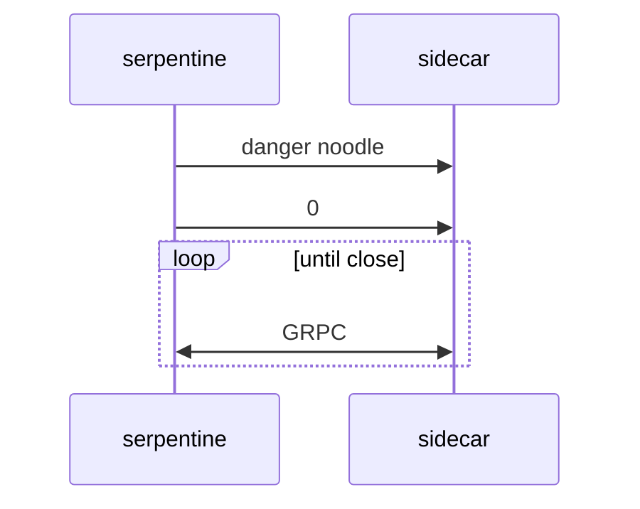
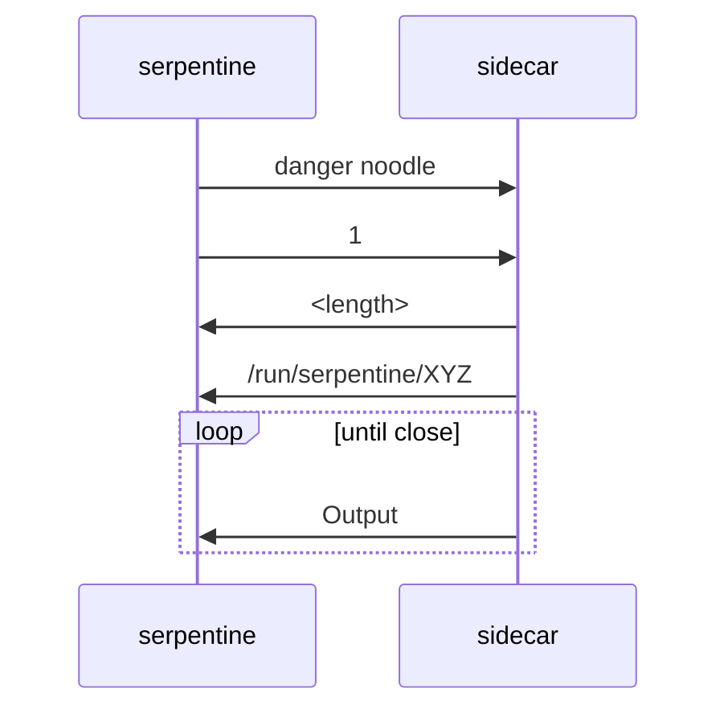

# Sidecar

This page details the communication protocol for the serpentine sidecar. 

> [!WARNING]
> This document is intended for contributors and should not be taken to be a stable contract.
> In fact any non-serpentine process talking to its sidecar is to be considerd un-docummented.

All these apis are exposed on the containers `8000` ports, which gets mapped to a random one on the host.

The socket expects the following as its first bytes:
| Bytes | Content | Description |
| :---: | ------- | ----------- |
| 13    | `danger noodle` | This essentialy works as a header/magic bytes/verification step, it ensures that anything connecting to the socket is at the very least aware its talking to serpentine. This stops us from doing very bad stuff based on garbage data, and more importantly very effectively shuts down any potential for stuff like browsers to ever sucessfully connect to our socket as websites dont have low enough controll of the connection to prefix it with this string.|
| 1 | 0-1 | The kind of the request  |

After this the content is defined by the request kind specified

| Event | Id |
| ----- | :-: | 
| Containerd Proxy | 0 |
| Process Output | 1 |

## Containerd Proxy (`0`)
Once this connection is established all further data on the socket will be proxied to `containerd.sock` (and any data from the unix socket is proxied back).
Essentially after this point this socket is valid to pass to a containerd client library.

## Process Output (`1`)
The sidecar will send a u8 representing the length of the following path, and then path data, this is the in container path to the stdout socket.
Afterwards the sidecar will start streaming the data on stdout/stderr to the socket.

| Bytes | Content | Example |
| :---: | ------- | ------- |
| 1 | number of bytes | 19 |
| n | pipe path in the container | /run/serpentine/XYZ |
| until close | Stdout/Stderr data | Compiling ... |

See [Containerd](containerd.md) for more details on the surrounding context flow.
