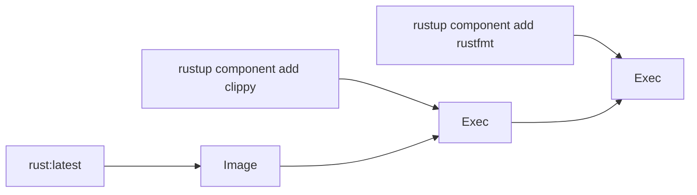
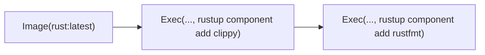
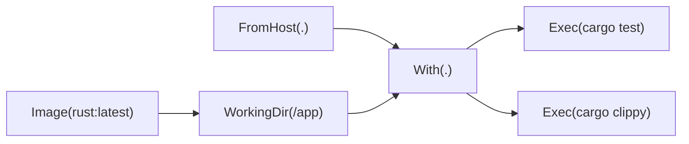
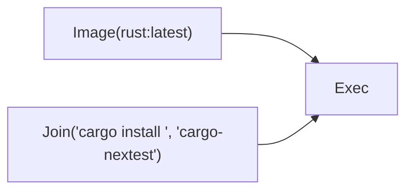
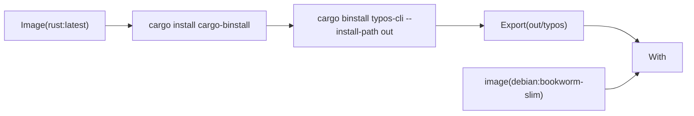
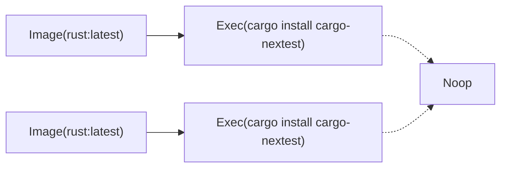
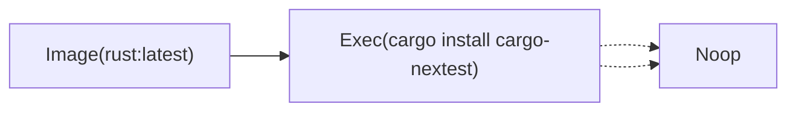

# Snek

Snek is serpentines DSL and the main way you interact with it, its built to be simple and expressive.
To get a taste of what we will be learning, heres a simple serpentine pipeline to run the tests from a rust project:
```snek
export DEFAULT = Image("rust:latest")
    > WorkingDir("/app")
    > With(FromHost("."), ".")
    > Exec("cargo test");
```

> [!NOTE]
> This page documents the syntax and semantics of the language and will use the prelude nodes in examples, but these are documented in later pages in the "Standard library section."

## Syntax 

### Comments
Comments in snek are either pre-fixed with `//`, or are multi-line or even inline content delimited by `/*` and `*/`
```snek
// I am a single line comment

/*
I am a multi line comment
*/

foo = /* I am a inline comment */ 10;
```

### Nodes 
The core primitive in snek is the node, its defined like a function call, `A()`, and it can take arguments, `A(1, 2, 3)`.
In fact this is all you need to express everything snek can express, the rest is simple ergonomics and de-duplications. 

while generally you might think of most operations as a chain of operations, and we will get to the syntactic sugar for that, but its important to keep in mind that at the end of the day serpentine just sees nodes and their arguments. For example a chain of commands is really just one `Exec` call taking the output of another as a argument.

For example `Exec(Exec(Image("rust:latest"), "rustup component add clippy"), "rustup component add rustfmt")` is represented as the following graph:


For the rest of this page for simplicity we will inline literals into their nodes, as such:


### Chaining
Now its a very common pattern to apply a chain of operations one after the other, think of method chaining, function composition in haskell, etc. 
Snek allows this using the `>` operator, which places the left hand side as the first argument to a node call on the right.
For example `A > B(1) > C(2)` compiles down to `C(B(A, 1), 2)`. As such the above example would more commonly be written as:

### Labels
Labels function like variables and let you assign the result of a node to a specific name, which lets you re-use it in multiple locations.
They are defined using `=` and ending with a `;`, for example `rust = Image("rust:latest")` lets you define your base image in one location.
Most commonly this will be used to share base images and setup steps.
For example you might create a label containing rust and your source code, then re-use this for both the linting and testing phase.
```snek
base = Image("rust:latest") > WorkingDir("/app") > With(FromHost("."), ".");
tests = base > Exec("cargo test");
lints = base > Exec("cargo clippy");
```

This will produce the following graph


This is one of serpentines stronger features, as it makes sharing setup logic extremely easy.

In other for a serpentine pipeline to be executed it needs to export a entrypoint label, if not specified otherwise on the cli this will be `DEFAULT`. for example:
```snek
export DEFAULT = Image("rust:latest")
    > WorkingDir("/app")
    > With(FromHost("."), ".")
    > Exec("cargo test");
```
(See further down about modules and other uses of `export`)

### Phantom inputs
Phantom inputs lets you make the scheduler wait on certain other nodes before containing with the execution of the given node, it can also be used to create a group of nodes. Phantom inputs are marked by adding a `!` before the node call and then the name of the label to wait on, for example `!tests Exec("cargo build")` will wait for the node pointed to by the `tests` label to complete before starting to pull the build exec. if you want to specify multiple phantom inputs use `()`, for example to define a set of tests one might do 
```snek
tests = !(unit_tests, integration_tests) Noop(0);
```

### Functions
Functions are effectively macros and allows the re-use of more complex steps, for example a one might use a function to install packages and also clear the package cache in one layer so one doesnt have to copy paste the command for that everywhere.
functions are defined with the `def` keyword, followed by a name and then arguments, and then a body delimited by `{}`. They are called like normal nodes.
Every function must contain one, and only one, `return`;

```snek
def Install(container, package) {
    return container > Exec(Join("cargo install ", package));
}
```

now we can use this function in the rest of our pipeline.

```snek
Image("rust:latest") > Install("cargo-nextest");
```
(remember that `>` puts the left hand side as the first argument, this is why most functions take say `container` as their first argument.)

Internally functions work by inlining, you might think this leads to duplication, but the optimizer (see below) actually means this leads to less duplication. Hence this leads to the following graph:


One big (and honestly super cool) advantage of functions and sneks arithecture in general is that functions can spin up other containers if they want to complete their job. For example the following function install the given package in another container then copies it over to the input, this has the amazing advantage that due to caching you can insert this call basically anywhere without worrying about invalidating the cache, as the actual install step will always stay cached as it doesnt depend on the input container.
```snek
def Binstall(container, crate, bin_name) {
    binary = Image("rust:latest")
        > Exec("cargo install cargo-binstall")
        > Exec(Join("cargo binstall ", crate, " --install-path out"))
        > Export(Join("out/", bin_name));

    return container > With(binary, Join("/bin/", bin_name));
}
```
This function can be used like `Image("debian:bookworm-slim") > Binstall("typos-cli", "typos")` (another neat thing is that the target container doesnt have to have rust/cargo installed.)

In this case it will construct a graph like:


## Modules 
While snek has a nice selection of builtins it is often nice to share more complex functions or even just labels between files, in fact everything in the standard library (except the prelude) is implemented in snek itself. 
Modules in snek mark what they wish to be public using the `export` keyword, generally this can be prefixed between labels, functions, or imports.
```snek
export import "./abc.snek" as abc;

export def Foo(container) { /* ... */ }

export bar = Foo(Image("rust:latest"));
```

And as seen just above imports take the form of `import "relative_path" as name`, the path is relative to the current file (i.e **not** relatiev to the cwd of the process). Item paths use the rust syntax of `::`, for example if we import the above file we might use it like:
```snek
import "path_to_file.snek" as module;

example = module::bar > module::Foo() > module::abc::SomethingElse();
```

The std-lib is imported in the same way, with the caveat that `@` is used as a alias to the stdlibs installation path, for example `import "@/rust.snek" as rust;`

## Naming connventions 
Snek identifiers must consist of a alphabetic character followed by a mix of alphanumeric and `-` and `_` values.
In other words they must match the following regex, `[a-zA-Z][a-zA-Z0-9_-]+`.

While not a requirement, in general snek code should use snake_case for labels and modules, and PascalCase for functions, these are the connventions the stdlib uses.

## Optimizer 

> [!NOTE]
> This section documents a few of the optimization passes at the time of writing and is here to inform you about what does not need optimizing manually in your pipelines, but should not be taken as a complete stability guarantee. 

The most important optimization the compiler does, especially considering that functions are inlined, is de-duplicating equal branches in a graph.
While you might think that 
```snek
foo = Image("rust:latest") > Exec("cargo install cargo-nextest");
bar = Image("rust:latest") > Exec("cargo install cargo-nextest");
baz = !(foo, bar) Noop(0);
```
would produce the following graph:

But in fact it generates this graph:


This becomes even more important with Functions take our `Binstall` function from before, without this optimization every call to it would install binstall and the given tool every time, but with the de-duplicator binstall is only installed ones, and each specific tool is also only installed once.
This means you can write functions as ergonomicly as you want and as long as you are smart with at which points you introduce the arguments you can still get amazing performance.
